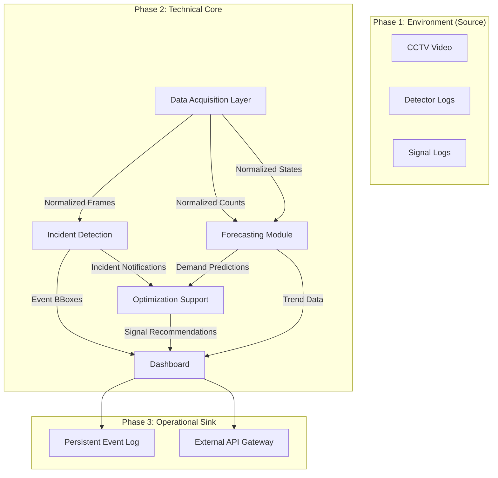

# Architecture Design Plan — Phase 2

This document defines the structural blueprint for the Traffic Intelligence System. The architecture is designed to be modular, ensuring that the Wadi Saqra implementation can be scaled to multiple sites in Phase 3.

---

## 1. System Overview
The system follows a modular "Pipeline" architecture. Data flows from the physical/simulated environment through a normalization layer, into domain-specific intelligence modules, and finally to an operator-facing dashboard.

### Core Modules
1.  **Data Acquisition Layer (DAL)**: The "Entry Point." Handles raw ingestion and normalization.
2.  **Incident Detection Module (IDM)**: The "Eyes." Processes video for immediate events.
3.  **Forecasting Module (FM)**: The "Memory." Predicts future demand based on history and signals.
4.  **Optimization Support Module (OSM)**: The "Logic." Recommends signal adjustments.
5.  **Dashboard Hub**: The "Face." Centralizes visualization and alerts.

---

## 2. Data Flow Diagram

---

## 3. Module Interaction Logic
- **Contracts**: All communication between modules must follow the JSON schemas defined in `/data_sandbox/schemas/`.
- **Statelessness**: Intellectual modules (IDM, FM) should ideally be stateless, processing the current "Window" of data provided by the DAL.
- **Timestamp Alignment**: Every packet of data moving between modules must carry the `canonical_timestamp` (April 21, 2026 reference).

---

## 4. Multi-Site Scalability Design
To prepare for Phase 3, the architecture implements:
- **Site ID Injection**: All data structures are prefixed with `site_id` (e.g., `AMM-WS-01`).
- **Configuration-Driven Ingestion**: The DAL uses the `camera_registry.json` and `approach_map.json` from Phase 1 to understand the geometry of the site, rather than having hardcoded logic.
- **Adapter Pattern**: The DAL uses adapters to ingest different source formats (SUMO CSVs today, real-world APIs tomorrow) while providing a consistent output to the intelligence modules.
