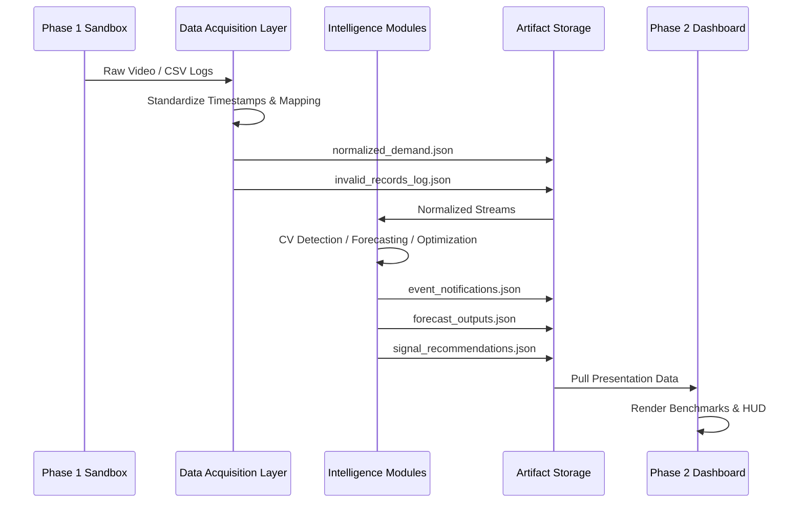

# Data Flow Diagram (Phase 2)

```mermaid
sequenceDiagram
    participant P1 as Phase 1 Sandbox
    participant DAL as Data Acquisition Layer
    participant AI as Intelligence Modules
    participant ART as Artifact Storage
    participant DB as Phase 2 Dashboard

    P1->>DAL: Raw Video / CSV Logs
    DAL->>DAL: Standardize Timestamps & Mapping
    DAL->>ART: normalized_demand.json
    DAL->>ART: invalid_records_log.json

    ART->>AI: Normalized Streams
    AI->>AI: CV Detection / Forecasting / Optimization
    AI->>ART: event_notifications.json
    AI->>ART: forecast_outputs.json
    AI->>ART: signal_recommendations.json

    ART->>DB: Pull Presentation Data
    DB->>DB: Render Benchmarks & HUD
```
