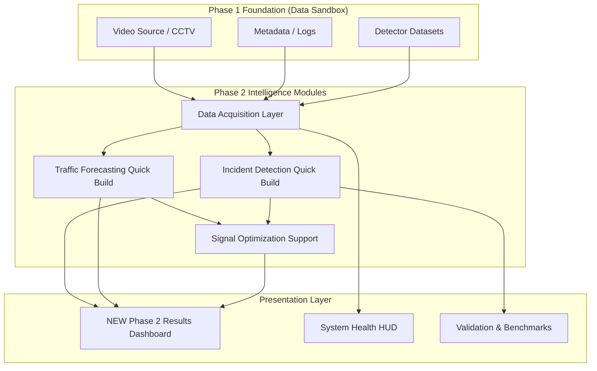

# System Architecture Diagram (Phase 2)

```mermaid
graph TD
    subgraph "Phase 1 Foundation (Data Sandbox)"
        VS[Video Source / CCTV]
        ML[Metadata / Logs]
        DS[Detector Datasets]
    end

    subgraph "Phase 2 Intelligence Modules"
        DA[Data Acquisition Layer]
        ID[Incident Detection Quick Build]
        TF[Traffic Forecasting Quick Build]
        SO[Signal Optimization Support]
    end

    subgraph "Presentation Layer"
        P2D[NEW Phase 2 Results Dashboard]
        SH[System Health HUD]
        VAB[Validation & Benchmarks]
    end

    VS --> DA
    ML --> DA
    DS --> DA

    DA --> ID
    DA --> TF
    TF --> SO
    ID --> SO

    ID --> P2D
    TF --> P2D
    SO --> P2D
    DA --> SH
    ID --> VAB
```
