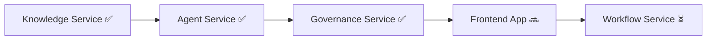

# Jordan National Policy Intelligence Platform — Milestones Overview

---

## Current Status

```
████████████████████████████░░ 75% Complete
```

| Service | Status | Progress |
|---|---|---|
| **Knowledge Service** | ✅ Production-ready | ██████████ 100% |
| **Agent Service** | ✅ Production-ready | ██████████ 100% |
| **Governance Service** | ✅ Production-ready | ██████████ 100% |
| **Frontend App** | 🔜 Next (MVP Demo) | ░░░░░░░░░░ 0% |
| **Workflow Service** | ⏳ Post-Demo | ░░░░░░░░░░ 0% |

---

## Recommended Build Order



### Why Frontend App Next?

1. **Tuesday MVP Demo** — We have a hard deadline. The backend is 100% ready (Knowledge, Agent, Governance). We need a UI to showcase the platform's core capabilities.
2. **Workflow can wait** — Ticketing and human-in-the-loop (HITL) are Day-2 operational features. The core AI value is proven via the Chat UI and citation engine.
3. **Architecture is Decoupled** — The Frontend talks directly to the Agent Service (`/query`). The Agent Service *already* acts as a secure gateway, automatically calling the Governance Service for guardrails and the Knowledge Service for data. 

---

## Milestone Plan

### Milestone 1: Knowledge Engine ✅ COMPLETE
**Duration:** ~2 weeks | **Delivered:** March 12, 2026

| Phase | Feature | Status |
|---|---|---|
| 1-3 | Core chunking, embedding, vector search | ✅ |
| 4 | Auto-classification & versioning | ✅ |
| 5 | Legal metadata extraction | ✅ |
| 6 | Multi-format support (DOCX, PPTX) + batch API | ✅ |
| 7 | Testing dashboard UI | ✅ |
| 8 | Legal document specialization | ✅ |
| 9 | Event loop optimization (threadpool) | ✅ |
| 10 | Prime Ministry roadmap alignment (sectors, visibility, approval) | ✅ |
| — | Docker + .env + .gitignore setup | ✅ |
| — | Gemini Embedding 2 technical documentation | ✅ |

---

### Milestone 2: Agent Orchestration ✅ COMPLETE
**Duration:** ~2 weeks | **Delivered:** March 15, 2026

| Phase | Feature | Status |
|---|---|---|
| 1 | FastAPI scaffold + Knowledge Service client | ✅ |
| 2 | Router Agent (intent detection, sector routing) | ✅ |
| 3 | Legal Affairs Specialist Agent | ✅ |
| 4 | Tool abstraction layer (search, source details) | ✅ |
| 5 | Citation enforcement + confidence scoring | ✅ |
| 6 | Amendment reasoning (detect superseded clauses) | ✅ |
| 7 | Self-verification step | ✅ |
| 8 | Escalation triggers | ✅ |
| 9 | Delegation engine (multi-agent merge) | ✅ |
| 10 | Conversation memory + session management | ✅ |
| 11 | Docker + API docs | ✅ |

**Key Deliverable:** `POST /query` returns a government-grade answer with citations, confidence, and amendment warnings.

---

### Milestone 3: Governance & Platform Integrity ✅ COMPLETE
**Duration:** ~1.5 weeks | **Delivered:** March 15, 2026

| Phase | Feature | Status |
|---|---|---|
| 1 | Input guardrails (prompt injection, off-topic detection) | ✅ |
| 2 | Output guardrails (hallucination check, compliance) | ✅ |
| 3 | Audit logging (every query, every response) | ✅ |
| 4 | Evaluation framework (accuracy, latency, cost) | ✅ |
| 5 | Performance metrics + observability | ✅ |
| 6 | CI/CD pipeline + release management | ✅ |
| 7 | Security validation | ✅ |

---

### Milestone 4: Frontend Intelligence Platform (MVP Demo) 🔜 NEXT
**Estimated Duration:** 2 days (Prioritized for Tuesday Demo)

| Phase | Feature | Priority |
|---|---|---|
| 1 | Chat interface (Arabic-first) with streaming | 🔴 Critical |
| 2 | Citation viewer + source panel (PDF/DOCX images) | 🔴 Critical |
| 3 | Confidence explanation UI | 🟡 High |
| 4 | Role switching (citizen/employee/admin) | 🟢 Medium |
| 5 | Simple Admin console (audit viewer, metrics) | 🟢 Medium |

---

### Milestone 5: Workflow & HITL Operations ⏳ POST-DEMO
**Estimated Duration:** ~2-3 weeks (Post-Demo)

| Phase | Feature | Priority |
|---|---|---|
| 1 | Ticket creation + escalation state machine | 🔴 Critical |
| 2 | Human assignment + resolution workflow | 🔴 Critical |
| 3 | Notification engine | 🟡 High |
| 4 | Feedback ingestion + response archive | 🟡 High |
| 5 | RBAC + admin APIs | 🟡 High |
| 6 | SLA tracking + queue prioritization | 🟢 Medium |
| 7 | Activity timeline | 🟢 Medium |

---

## Architecture Diagram

```
┌─────────────────────────────────────────────────────────────┐
│                     Frontend App (React/Vue/Svelte)         │
│              Chat │ Citations │ Dashboard │ Admin            │
└──────────────────────────┬──────────────────────────────────┘
                           │ REST API (/query)
┌──────────────────────────▼──────────────────────────────────┐
│                   Agent Service (FastAPI :9200)               │
│  [Input Guardrail Gate] -> Calls Governance (Sync)            │
│  ┌─────────┐  ┌──────────┐  ┌───────────┐  ┌──────────┐    │
│  │ Router  │→ │ Legal    │  │ Policy    │  │ General  │    │
│  │ Agent   │  │ Agent    │  │ Agent     │  │ Agent    │    │
│  └────┬────┘  └────┬─────┘  └─────┬─────┘  └────┬─────┘    │
│  [Output Guardrail Gate] -> Calls Governance (Sync)           │
│       │            │              │              │          │
│  ┌────▼────────────▼──────────────▼──────────────▼─────┐    │
│  │          Tool Abstraction Layer                      │    │
│  │  search_knowledge() │ get_source() │ get_page()     │    │
│  └──────────────────────────┬──────────────────────────┘    │
│  [Audit Log Async Task] -> Calls Governance (Async)           │
└─────────────────────────────┼───────────────────────────────┘
                              │ HTTP
┌─────────────────────────────▼───────────────────────────────┐
│              Knowledge Service (FastAPI :9100)  ✅           │
│  Ingestion │ Classification │ Embedding │ Retrieval         │
│  Security Filtering │ Versioning │ Sector Routing           │
└─────────────────────────────────────────────────────────────┘

┌──────────────────────┐  ┌──────────────────────────────────┐
│ Governance (:9300)✅  │  │ Workflow Service (:9400) ⏳       │
│ Guardrails│Audit│Eval│  │ Tickets│Escalation│HITL│RBAC     │
└──────────────────────┘  └──────────────────────────────────┘
```

---

## Key Files for Handoff

| File | Location | Purpose |
|---|---|---|
| Knowledge Engine Reference | `docs/knowledge_engine_complete.md` | Everything about the knowledge service |
| Agent Service Prompt | `docs/agent_service_prompt.md` | Full prompt for building the agent service |
| This Overview | `docs/platform_milestones.md` | Platform-wide milestones |
| Embeddings Documentation | `knowledge-service/docs/embeddings2.md` | Gemini Embedding 2 technical docs |
| Team Guide | (user's original doc) | Full platform architecture mandate |

---

*Last updated: March 12, 2026*
